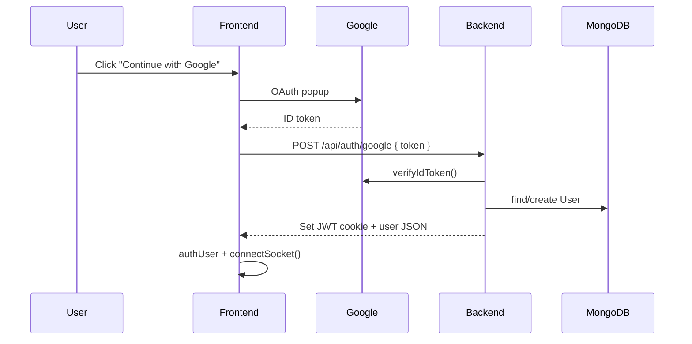

# Google Login Setup

This document explains how Google OAuth sign-in was added to Chatify and how to configure it locally or in production.

## Overview

Google login uses the same session model as email/password auth:

1. The user signs in with Google on the frontend.
2. Google returns an **ID token** (JWT).
3. The frontend sends that token to `POST /api/auth/google`.
4. The backend verifies the token with Google, finds or creates a user in MongoDB, and sets the existing **JWT httpOnly cookie**.
5. The rest of the app (chat, sockets, protected routes) works unchanged because it already relies on `authUser._id`.



## Files changed

### Backend

| File | Change |
|------|--------|
| `backend/src/models/user.model.js` | Added `googleId`, `authProvider`; made `password` optional for Google users |
| `backend/src/controllers/auth.controller.js` | Added `googleAuth` controller; updated `Login` to block password login on Google-only accounts |
| `backend/src/routes/auth.routes.js` | Added `POST /google` route |
| `backend/package.json` | Added `google-auth-library` |

### Frontend

| File | Change |
|------|--------|
| `frontend/src/components/GoogleLoginButton.jsx` | Reusable Google sign-in button |
| `frontend/src/store/useAuthStore.js` | Added `loginWithGoogle()` action |
| `frontend/src/main.jsx` | Wrapped app in `GoogleOAuthProvider` |
| `frontend/src/pages/Login.jsx` | Added Google button below email/password form |
| `frontend/src/pages/SignUp.jsx` | Added Google button below signup form |
| `frontend/package.json` | Added `@react-oauth/google` |

## Database schema

The `User` model now supports both local and Google accounts:

```js
{
  email: String,          // required, unique
  fullName: String,       // required
  password: String,       // optional (Google users don't have one)
  googleId: String,       // optional, unique (sparse index)
  authProvider: String,   // "local" | "google", default "local"
  profilePic: String,     // optional; populated from Google avatar on first login
}
```

Existing users in MongoDB are unaffected. They keep working with email/password and default to `authProvider: "local"`.

## API endpoint

### `POST /api/auth/google`

**Request body**

```json
{
  "token": "<google-id-token>"
}
```

**Success (`200`)**

```json
{
  "_id": "...",
  "fullName": "Jane Doe",
  "email": "jane@gmail.com",
  "profilePic": "https://...",
  "authProvider": "google"
}
```

Also sets the same `jwt` httpOnly cookie used by `/login` and `/signup`.

**Error cases**

| Status | Message | Reason |
|--------|---------|--------|
| 400 | Google token is required | Missing token in body |
| 400 | Invalid Google account data | Token verified but missing email/sub |
| 400 | This account uses Google sign-in... | User tries password login on Google-only account |
| 401 | Google authentication failed | Invalid/expired Google token |
| 500 | Google OAuth is not configured | `GOOGLE_CLIENT_ID` missing on backend |

## Account linking behavior

| Scenario | Behavior |
|----------|----------|
| New Google user | Creates user with `googleId`, no password |
| Google email matches existing local account | Links Google to that account (adds `googleId`, sets `authProvider: "google"`) |
| User signs in with Google again | Finds user by `googleId` and logs in |
| Google-only user tries email/password login | Returns error asking them to use Google |

## Google Cloud Console setup

1. Go to [Google Cloud Console](https://console.cloud.google.com/).
2. Create or select a project.
3. Open **APIs & Services → Credentials**.
4. Click **Create Credentials → OAuth client ID**.
5. Choose **Web application**.
6. Add **Authorized JavaScript origins**:
   - `http://localhost:5173` (Vite dev server)
   - Your production frontend URL
7. Copy the **Client ID** (you do not need a client secret for this flow).

No extra Google APIs need to be enabled for basic sign-in with Google Identity Services.

## Environment variables

### Backend (`backend/.env`)

```env
GOOGLE_CLIENT_ID=your-google-client-id.apps.googleusercontent.com
JWT_SECRET=your-jwt-secret
MONGODB_URI=your-mongodb-uri
```

### Frontend (`frontend/.env`)

```env
VITE_GOOGLE_CLIENT_ID=your-google-client-id.apps.googleusercontent.com
```

Use the **same Client ID** on both frontend and backend. The frontend uses it to initialize Google's sign-in widget; the backend uses it to verify the ID token audience.

Restart both dev servers after adding env vars.

## How to test locally

1. Add env vars to `backend/.env` and `frontend/.env`.
2. Start backend: `cd backend && npm run dev`
3. Start frontend: `cd frontend && npm run dev`
4. Open `http://localhost:5173/login`
5. Click **Continue with Google**
6. After sign-in, you should land on the home page with socket connected
7. Verify in MongoDB that a user was created with `googleId` and `authProvider: "google"`

## Security notes

- The Google **ID token** is verified server-side with `google-auth-library` — the backend never trusts client-provided email/name without verification.
- Session auth still uses your existing JWT cookie (`generateToken`), so middleware and sockets remain unchanged.
- Google users have no password stored, so password login is explicitly blocked for those accounts.

## Troubleshooting

| Issue | Fix |
|-------|-----|
| Google button not visible | Set `VITE_GOOGLE_CLIENT_ID` in `frontend/.env` and restart Vite |
| "Google OAuth is not configured" | Set `GOOGLE_CLIENT_ID` in `backend/.env` |
| "Google authentication failed" | Client IDs must match; token may be expired — try again |
| OAuth popup blocked | Allow popups for localhost |
| `redirect_uri_mismatch` | Add correct origin under Authorized JavaScript origins in Google Console |
